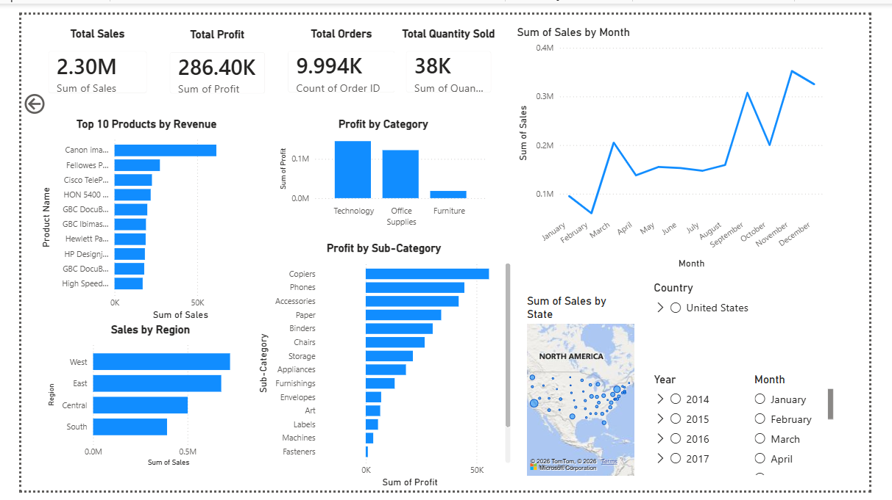

# FUTURE_DS_01
Power BI dashboard analyzing business sales performance, revenue trends, top-selling products, profitability, and regional sales insights using the Superstore dataset

# Business Sales Performance Analytics Dashboard

## Project Overview

This project analyzes business sales performance using Power BI to identify revenue trends, top-selling products, profitable categories, and regional sales performance. The goal is to provide actionable business insights and support data-driven decision-making.

This project was completed as part of the Future Interns Data Science & Analytics Internship Program (Task 1).

## Objectives

- Analyze sales performance over time.
- Identify top-selling products.
- Evaluate category profitability.
- Compare regional sales performance.
- Generate business insights and recommendations.

## Tools Used

- Power BI
- Excel / CSV Dataset
- Data Cleaning
- Data Visualization
- Business Analytics

## Dashboard Features

### KPI Metrics
- Total Sales: $2.30M
- Total Profit: $286.40K
- Total Orders: 9,994
- Total Quantity Sold: 38K

### Visualizations
- Sales Trend Over Time
- Top 10 Products by Revenue
- Profit by Category
- Sales by Region
- Profit by Sub-Category
- Sales by State Map
- Interactive Filters (Country, Year, Month)

## Key Insights

- Technology is the most profitable category.
- West region generates the highest sales.
- November records the highest monthly sales.
- Copiers and Phones are among the most profitable sub-categories.
- Sales performance increases significantly during the final quarter of the year.
- Furniture contributes lower profit compared to other categories.

## Business Recommendations

- Focus marketing efforts on top-performing products.
- Increase inventory during high-sales months.
- Expand business strategies in high-performing regions.
- Improve profitability in lower-performing categories.
- Prioritize high-margin products to maximize profit.

## Dashboard Preview

## Repository Contents

- Business_Sales_Performance_Analytics.pbix
- SalesDashboard.png
- README.md
- Dataset File
